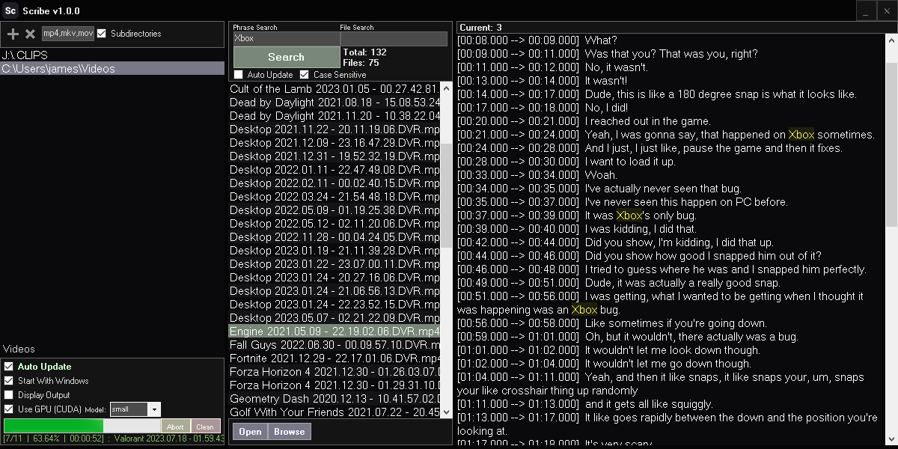

<!--  -->


# [<b>>> Download Latest</b>](https://github.com/o7q/Scribe/releases/download/v1.0.2.0/Scribe.exe)
### Welcome! Scribe is a simple, compact, offline, GUI based media transcriber that enables you to search for local media content based on its spoken words.

---



---

# Overview
Scribe uses OpenAI's whisper model to process audio files.\
FFmpeg is used beforehand to handle a wide variety of media formats.

### **Powered by**
whisper: https://github.com/openai/whisper \
FFmpeg: https://ffmpeg.org

---

# Installation

1. Ensure you have Python 3.9 or newer installed \
You can check your version by typing this command:
```powershell
python --version
```
2. Download the bootstrapper from https://github.com/o7q/Scribe/releases
3. Select your preferred device type (CPU or CUDA) \
You can check your CUDA version by typing this command:
```
nvidia-smi
```
4. Click install and wait for it to complete

---

## **Interface**

<details>
<summary><b>Selection</b></summary>

- **Add Folder Button** Adds a watch folder to scan from
- **Remove Folder Button** Removes the selected watch folder
- **Media Formats Textbox** Media formats to scan for (separate with a comma)
- **Subdirectories Checkbox** Enable the searching of subdirectories

</details>

<details>
<summary><b>Processing</b></summary>

- **Auto Update Checkbox** Enable the automatic processing of watch folders
- **Update Button** Manually process media
- **Start With Windows Button** Makes the program start with your computer
- **Display Output Checkbox** Display a console while processing
- **Pause Checkbox** Insert a pause command
- **Use GPU Checkbox** Enable the usage of supported NVIDIA CUDA GPUs
- **Model Listbox** The model for the whisper speech-to-text algorithm (default is: **small**)
- **Abort Button** Cancels the process
- **Clean Button** Cleans storage files that no longer have the corresponding media file tied to it, it also cleans temporary files

</details>

<details>
<summary><b>Searching</b></summary>

- **Phrase Search Textbox** The phrase to search for
- **File Search Textbox** The specific file to search for (leave blank to show all files that contain the phrase)
- **Search Button** Searches with the specified settings
- **Auto Update Checkbox** Automatically updates the search without having to click the **Search Button**
- **Case Sensitive Checkbox** Enable case sensitivity
- **Open File Button** Opens the selected file
- **Browse File Button** Browses to the selected file in Windows Explorer

</details>

<details>
<summary><b>Viewing</b></summary>

- **View Panel** This will display all of the written text as well as their timestamps of the selection media, it will highlight every occurrence of the searched phrase

</details>

---

**Scribe** \
Written in C# with .NET Framework 4.8